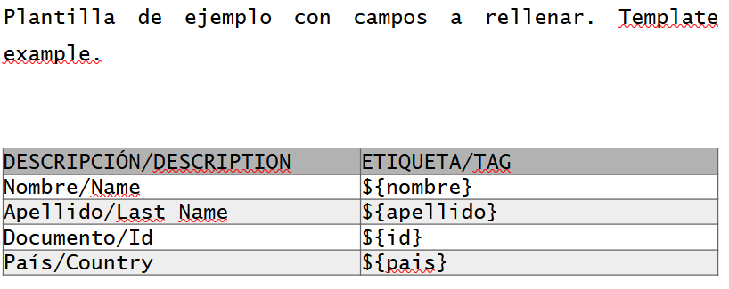
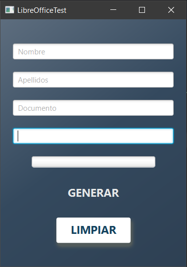

## RESUMEN/RESUME
Esta es una simple aplicación de JavaFX que sirve como ejemplo de como cumplimentar documentos en LibreOffice WRITER a través de una aplicación de Java.
*This is a simple JavaFX application that serves as an example of how to fill documents in LibreOffice WRITER through a Java application.*

## ESTRUCTURA/STRUCTURE
La aplicación ha sido creada con OpenJDK7, JavaFX17 en un proyecto MAVEN y usa las librerías simple-odf y odfdom-java. Siguiendo las buenas prácticas de programación en JavaFX 
se ha creado un servicio heredando de la clase Service de JavaFX que evita que se bloquee la interfaz y permite asociar elementos que muestran el progreso
del servicio, como una progressBar.
*The application has been created with OpenJDK7, JavaFX17 in a MAVEN project and uses the simple-odf and odfdom-java libraries. Following the good practices of programming in JavaFX 
a service has been created inheriting from the JavaFX Service class that prevents the interface from blocking and allows to associate elements that show the progress of the service, such as a progressBar.
of the service, such as a progressBar.*

## PASOS PARA ADAPTARLO A TU PROYECTO/STEPS TO USE IN YOUR PROYECT

1.**Prepara el documento de Writer que usarás como plantila/Prepare your writer template**
En el repositorio se incluye una plantilla de ejemplo. Una vez que tengas tu documento listo, tienes que crear los placeholders. En realidad no son placeholders como tales, dado que la aplicación lo que busca es la secuencia que tú le indiques, pero puedes usar una expresión concreta para distinguir los elementos que quieras cambiar del resto del texto.
*A sample template is included in the repository. Once you have your document ready, you have to create the placeholders. They are not really placeholders as such, since the application looks for the sequence you indicate, but you can use a specific expression to distinguish the elements you want to change from the rest of the text.* 
En mi caso he utilizado esta forma de indicar los placeholders. *This is how I decide to create the placeholders in the template*: ${example}


2.**Estructura el proyecto/Structure your project**
Dado que es un proyecto con JavaFX que utiliza el enfoque MVC, el proyecto mantiene dicha esctructura. Pero ademas, para seguir con las buenas prácticas, se ha creado una clase que hereda de la clase Service de Java FX. Esto evita que el hilo en el que se ejecuta la GUI se bloquee y permite una mejor modularización. Esta clase se llama **WriterService**
*Since it is a JavaFX project using the MVC approach, the project maintains this structure. But in addition, to follow best practices, a class has been created that inherits from the Java FX Service class. This prevents the thread in which the GUI is executed from blocking and allows a better modularization.* The name of this class is **WriterService**

En el POM no olvides añadir las librerías simple-odf y odfdom-java. Tampoco olvides añadir los módulos en el archivo module-info.
*In the POM do not forget to add the simple-odf and odfdom-java libraries. Also do not forget to add the modules in the module-info file.*

-POM 
```
<dependency>
            <groupId>org.odftoolkit</groupId>
            <artifactId>simple-odf</artifactId>
            <version>0.9.0</version>
        </dependency>
    <dependency>
        <groupId>org.odftoolkit</groupId>
        <artifactId>odfdom-java</artifactId>
        <version>0.12.0</version>
    </dependency>
```

-Module-info.java
``requires simple.odf``

3.**Interfaz/GUI**
Para la interfaz se ha utilizado un archivo fxml y se ha utilizado OpenSceneBuilder para su configuración. Finalmente, el estilo se ha creado mediante un css.
*An fxml file was used for the interface and OpenSceneBuilder was used for its configuration. Finally, the style was created using a css.*



**ANALIZA EL CÓDIGO Y ADÁPTALO A TU PROYECTO/ANALIZE THE CODE AND ADAPT IT TO YOUR PROYECT**
**SI TE GUSTA, DA UNA ESTRELLA!/ IF YOU LIKE GIVE ME A STAR**


